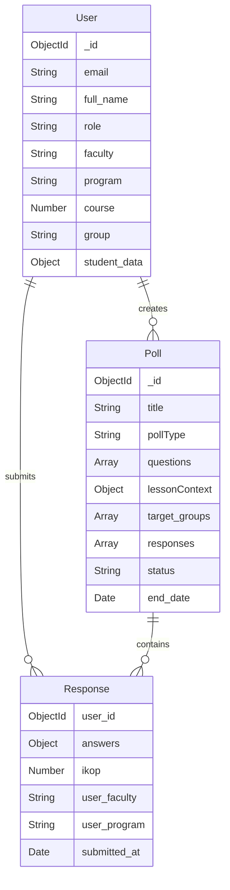

# 📚 ДОКУМЕНТАЦИЯ ПРОЕКТА StudVote

## 🎯 Обзор проекта

**StudVote** — это комплексная платформа для проведения опросов и оценки качества образовательного процесса в университете (Финансовый Университет при Правительстве РФ). Система предоставляет инструменты для студентов, преподавателей и администрации для сбора и анализа обратной связи о занятиях, преподавателях и учебных программах.

### Основные возможности:
- ✅ Многоролевая система (студенты, преподаватели, администраторы)
- ✅ Опросы после занятий с расчетом ИКОП (Индекс Качества Образовательного Процесса)
- ✅ Кастомные опросы и формы
- ✅ Интеграция с расписанием РУЗ (система расписания университета)
- ✅ Генерация опросов с помощью AI (GigaChat)
- ✅ Детальная аналитика и визуализация данных
- ✅ Геймификация для студентов
- ✅ Real-time уведомления

---

## 🏗️ Архитектура системы

### Технологический стек

#### Frontend (Client)
- **React 19** — основной UI фреймворк
- **React Router DOM** — маршрутизация
- **Material-UI (MUI)** — компонентная библиотека
- **Tailwind CSS** — стилизация
- **Axios** — HTTP клиент
- **Socket.io Client** — WebSocket соединения
- **ECharts** — визуализация данных
- **Recharts** — графики и диаграммы
- **React Calendar** — календарь событий
- **QRCode.react** — генерация QR-кодов
- **html2pdf.js** — экспорт в PDF
- **xlsx** — экспорт в Excel

#### Backend (Server)
- **Node.js** — серверная среда
- **Express 5** — веб-фреймворк
- **MongoDB (Mongoose)** — основная база данных
- **Redis (ioredis)** — кэширование и временное хранение
- **JWT** — аутентификация
- **Socket.io** — WebSocket сервер
- **Axios** — HTTP клиент для внешних API
- **Nodemailer** — отправка email
- **QRCode** — генерация QR-кодов
- **bcryptjs** — хеширование (если потребуется)

#### Внешние интеграции
- **RUZ API** (ruz.fa.ru) — расписание и академическая структура университета
- **GigaChat API** (Сбер) — генерация опросов с помощью AI

### Структура проекта

```
studvote/
├── client/                    # Frontend приложение
│   ├── public/               # Статические файлы
│   └── src/
│       ├── components/       # React компоненты
│       │   ├── Admin/       # Админские компоненты аналитики
│       │   ├── Analytics/   # Общая аналитика
│       │   ├── Auth/        # Аутентификация
│       │   ├── Layout/      # Шаблоны страниц
│       │   └── Polls/       # Компоненты опросов
│       ├── contexts/        # React Context API
│       ├── pages/           # Страницы приложения
│       ├── services/        # API сервисы
│       └── styles/          # Глобальные стили
│
└── server/                   # Backend приложение
    └── src/
        ├── config/          # Конфигурация (БД, Redis, константы)
        ├── controllers/     # Контроллеры маршрутов
        ├── middleware/      # Middleware (аутентификация)
        ├── models/          # Модели Mongoose
        ├── routes/          # Определение маршрутов API
        ├── services/        # Бизнес-логика
        ├── scripts/         # Скрипты миграции и seed
        └── server.js        # Точка входа сервера
```

---

## 🔐 Система аутентификации

### Принцип работы (Passwordless)

StudVote использует **бесконтактную аутентификацию** через email-верификацию:

1. **Запрос кода** (`POST /api/auth/request-code`)
   - Пользователь вводит email
   - Система определяет роль по домену:
     - `@edu.fa.ru` → студент
     - `@fa.ru` → преподаватель
     - `admin@fa.ru` → администратор
   - Генерируется 6-значный код
   - Код сохраняется в Redis (TTL 5 минут)
   - Код отправляется на email

2. **Проверка кода** (`POST /api/auth/verify-code`)
   - Пользователь вводит код
   - Система проверяет код в Redis
   - Если пользователь существует → выдается JWT токен
   - Если новый пользователь → выдается временный токен для регистрации

3. **Регистрация** (`POST /api/auth/register`)
   - Новый пользователь заполняет профиль:
     - **Студент**: ФИО, факультет, программа, курс, группа
     - **Преподаватель**: ФИО, кафедра, выбор из РУЗ
     - **Администратор**: только ФИО
   - Создается запись в MongoDB
   - Выдается постоянный JWT токен

### Модель пользователя (User)

```javascript
{
  email: String,              // Уникальный email
  full_name: String,          // ФИО
  role: String,               // 'student' | 'teacher' | 'admin'
  
  // Для студентов
  student_id: String,         // Номер студенческого (из email)
  faculty: String,            // Название факультета
  faculty_id: String,         // ID факультета
  program: String,            // Направление подготовки
  program_id: String,         // ID программы
  course: Number,             // Курс (1-5)
  group: String,              // Название группы
  group_id: Number,           // ID группы из РУЗ
  
  // Для преподавателей
  department: String,         // Кафедра
  ruz_teacher_id: String,     // ID преподавателя в РУЗ
  ruz_teacher_name: String,   // ФИО из РУЗ
  subjects: [String],         // Предметы
  
  // Геймификация (для студентов)
  student_data: {
    points: Number,           // Баллы за активность
    level: Number,            // Уровень
    badges: [ObjectId],       // Значки
    streak_days: Number       // Серия дней подряд
  },
  
  polls_participated: [ObjectId],  // Опросы, в которых участвовал
  polls_created: [ObjectId],       // Созданные опросы
  
  created_at: Date,
  updatedAt: Date
}
```

---

## 📊 Система опросов

### Типы опросов

StudVote поддерживает несколько типов опросов:

#### 1. **Lesson Review** (Опрос после пары)
- Фиксированная структура из 5 вопросов + комментарий
- Автоматический расчет ИКОП (Индекс Качества Образовательного Процесса)
- Привязка к конкретной паре из расписания РУЗ
- Технические проблемы (опциональный чекбокс)

**Фиксированные вопросы:**
1. Актуальность материала (вес 25%)
2. Понятность изложения (вес 30%)
3. Практическая ценность (вес 20%)
4. Вовлеченность студентов (вес 15%)
5. Организация занятия (вес 10%)
6. Дополнительный комментарий (текст)

#### 2. **Custom** (Кастомный опрос)
- Гибкая структура вопросов
- Типы вопросов:
  - `rating` — звезды 1-5
  - `yes_no` — Да/Нет
  - `choice` — выбор из списка
  - `text` — текстовый ответ

#### 3. **Старые типы** (для обратной совместимости)
- `subject_feedback` — отзыв о предмете
- `teacher_feedback` — отзыв о преподавателе
- `class_organization` — организация занятий

### Модель опроса (Poll)

```javascript
{
  title: String,                   // Название опроса
  description: String,             // Описание
  type: String,                    // Тип: 'single', 'multiple', 'rating', 'form', etc.
  pollType: String,                // 'lesson_review', 'custom', etc.
  
  // Варианты (для простых опросов)
  options: [{
    text: String,
    votes: Number,
    voters: [ObjectId]
  }],
  
  // Настройки
  is_anonymous: Boolean,           // Анонимность
  show_results: String,            // 'immediate', 'after_vote', 'after_end'
  visibility: String,              // 'public', 'group', 'faculty', etc.
  reward_points: Number,           // Баллы за участие
  minResponsesForResults: Number,  // Мин. ответов для показа результатов
  
  // Привязка к учебному процессу
  lessonContext: {
    lessonId: String,              // ID пары из РУЗ
    subject: String,               // Дисциплина
    teacher: String,               // Преподаватель
    date: Date,                    // Дата пары
    time: String,                  // Время "10:00-11:30"
    topic: String,                 // Тема пары
    auditorium: String,            // Аудитория
    lessonType: String,            // Тип (лекция, практика)
    group: String,                 // Группа
    groupId: String                // ID группы
  },
  
  // Создатель
  creator_id: ObjectId,
  creator_role: String,
  
  // Таргетинг (кому показывать)
  target_groups: [String],         // ID групп
  target_faculties: [String],      // Факультеты
  target_programs: [String],       // Программы
  target_courses: [Number],        // Курсы
  
  // Вопросы (для форм)
  questions: [{
    id: Mixed,                     // Уникальный ID вопроса
    text: String,                  // Текст вопроса
    type: String,                  // Тип вопроса
    required: Boolean,             // Обязательность
    weight: Number,                // Вес для ИКОП (0-1)
    block: String,                 // 'content', 'methodology', 'other'
    scale: Number,                 // Шкала (для rating)
    options: [String],             // Варианты (для choice)
    maxLength: Number              // Макс. длина (для text)
  }],
  
  // Ответы с метаданными
  responses: [{
    user_id: ObjectId,
    answers: Mixed,                // Ответы пользователя
    
    // Технические проблемы (для lesson_review)
    technical_issues: {
      has_issues: Boolean,
      selected: [String],
      description: String
    },
    
    // ИКОП (для lesson_review)
    ikop: Number,                  // 0-100
    
    // Метаданные для срезов (КРИТИЧНО!)
    user_faculty: String,
    user_faculty_name: String,
    user_program: String,
    user_program_name: String,
    user_course: Number,
    user_group: String,
    user_group_name: String,
    
    submitted_at: Date
  }],
  
  // Статус
  status: String,                  // 'draft', 'active', 'completed'
  start_date: Date,
  end_date: Date,
  
  // Статистика
  total_votes: Number,
  
  // Кэш аналитики
  cached_analytics: {
    overall_average: Number,
    by_faculty: Mixed,
    by_program: Mixed,
    by_course: Mixed,
    last_updated: Date
  }
}
```

### Workflow создания опроса

1. **Выбор типа опроса**
   - Lesson Review — после конкретной пары
   - Custom — свой опрос с гибкими вопросами

2. **Заполнение контента**
   - Lesson Review:
     - Выбор даты → загрузка расписания из РУЗ
     - Выбор конкретной пары
     - Система автоматически создает 5 стандартных вопросов
     - Опционально: включение чекбокса "Технические проблемы"
   
   - Custom:
     - Название, описание
     - Добавление вопросов вручную или генерация через AI (GigaChat)
     - Типы вопросов: rating, yes_no, choice, text

3. **Настройка таргетинга**
   - Кому показывать: всем, группе, факультету, программе, курсу
   - Анонимность
   - Видимость результатов
   - Награда (баллы)

4. **Публикация**
   - Установка срока действия
   - Опрос становится доступным студентам

---

## 📈 ИКОП (Индекс Качества Образовательного Процесса)

### Что такое ИКОП?

**ИКОП** — это численный показатель качества образовательного процесса от 0 до 100, рассчитываемый на основе ответов студентов на 5 стандартных вопросов опроса после пары.

### Формула расчета

```
ИКОП = Σ(нормализованная_оценка × вес_вопроса) × 100
```

**Нормализация оценки:**
```
нормализованная_оценка = (оценка - 1) / 4
```
- 1 звезда → 0.0
- 2 звезды → 0.25
- 3 звезды → 0.5
- 4 звезды → 0.75
- 5 звезд → 1.0

**Веса вопросов:**
- Q1 (Актуальность материала): **25%** (0.25)
- Q2 (Понятность изложения): **30%** (0.30)
- Q3 (Практическая ценность): **20%** (0.20)
- Q4 (Вовлеченность студентов): **15%** (0.15)
- Q5 (Организация занятия): **10%** (0.10)

**Итого:** 100% (1.0)

### Пример расчета

Студент поставил оценки:
- Q1: 5 звезд
- Q2: 4 звезды
- Q3: 5 звезд
- Q4: 3 звезды
- Q5: 4 звезды

Нормализация:
- Q1: (5-1)/4 = 1.0
- Q2: (4-1)/4 = 0.75
- Q3: (5-1)/4 = 1.0
- Q4: (3-1)/4 = 0.5
- Q5: (4-1)/4 = 0.75

Расчет:
```
ИКОП = (1.0 × 0.25) + (0.75 × 0.30) + (1.0 × 0.20) + (0.5 × 0.15) + (0.75 × 0.10) × 100
     = (0.25 + 0.225 + 0.20 + 0.075 + 0.075) × 100
     = 0.825 × 100
     = 82.5
     ≈ 83 (округление)
```

**Результат: ИКОП = 83** (Отлично)

### Зоны качества

| ИКОП | Зона | Цвет | Описание |
|------|------|------|----------|
| 80-100 | **Отлично** | 🔵 Голубой (#58D9F9) | Высокое качество образовательного процесса |
| 60-79 | **Хорошо** | 🟢 Зеленый (#7CFFB2) | Качество выше среднего, есть потенциал |
| 40-59 | **Требует внимания** | 🟡 Желтый (#FDDD60) | Необходимо обратить внимание |
| 0-39 | **Критично** | 🔴 Красный (#FF6E76) | Требуются срочные меры |

### Применение ИКОП

1. **Индивидуальные пары**
   - ИКОП рассчитывается для каждого ответа студента
   - Сохраняется в поле `responses[].ikop`

2. **Агрегация**
   - Средний ИКОП по дисциплине
   - Средний ИКОП по преподавателю
   - Средний ИКОП по группе
   - Средний ИКОП по факультету

3. **Проблемные зоны**
   - Дисциплины/группы с ИКОП < 60
   - Определение самого слабого критерия

4. **Топы**
   - Топ-3 дисциплины (по ИКОП)
   - Топ-3 преподавателя (по ИКОП)

5. **Динамика**
   - Изменение ИКОП во времени (по неделям/месяцам)
   - Тренды качества образования

---

## 🤖 Интеграция с GigaChat (AI)

### Возможности

StudVote интегрирована с **GigaChat API** (AI от Сбербанка) для автоматической генерации опросов.

### Функции

1. **Генерация полного опроса**
   - Входные данные: тема опроса (строка)
   - Результат: название, описание, варианты ответов

2. **Генерация вариантов ответов**
   - Входные данные: название опроса
   - Результат: 4-5 вариантов ответов

3. **Генерация анкеты (формы)**
   - Входные данные: тема анкеты
   - Результат: 3-7 вопросов разных типов

### Примеры использования

#### Генерация простого опроса
```
Тема: "Качество работы столовой"

Результат:
- Название: "Оценка качества работы студенческой столовой"
- Описание: "Помогите нам улучшить работу столовой"
- Варианты:
  1. "Отлично - всё устраивает"
  2. "Хорошо - есть небольшие замечания"
  3. "Удовлетворительно - много недостатков"
  4. "Плохо - требуется срочное улучшение"
```

#### Генерация анкеты
```
Тема: "Удовлетворенность онлайн-обучением"

Результат:
{
  "title": "Опрос об удовлетворенности онлайн-обучением",
  "description": "Ваше мнение о дистанционном формате",
  "questions": [
    {
      "text": "Оцените качество онлайн-платформы",
      "type": "rating",
      "required": true
    },
    {
      "text": "Хватает ли вам времени на выполнение заданий?",
      "type": "yes_no",
      "required": true
    },
    {
      "text": "Какие предметы вы предпочитаете изучать онлайн?",
      "type": "multiple",
      "options": ["Математика", "Программирование", "Языки", "Гуманитарные"]
    },
    {
      "text": "Ваши пожелания по улучшению",
      "type": "text",
      "required": false
    }
  ]
}
```

### Технические детали

- **Токен**: получается через OAuth с кэшированием
- **TTL токена**: автоматическое обновление за 1 минуту до истечения
- **Температура генерации**: 0.7 (баланс между креативностью и точностью)
- **Модель**: GigaChat
- **Парсинг**: автоматическое извлечение JSON из ответа AI

---

## 🗓️ Интеграция с РУЗ (Расписание)

### Что такое РУЗ?

**РУЗ** (ruz.fa.ru) — это система электронного расписания Финансового Университета. StudVote интегрируется с РУЗ для получения актуальных данных о:
- Расписании занятий
- Академической структуре (факультеты, программы, группы)
- Преподавателях
- Аудиториях

### Основные эндпоинты РУЗ

1. `/api/dictionary/faculties` — список факультетов
2. `/api/dictionary/groups` — список групп
3. `/api/search` — поиск преподавателей
4. `/api/schedule/group/{groupId}` — расписание группы

### Кэширование

Данные из РУЗ кэшируются в **Redis** для уменьшения нагрузки:
- **Академическая структура**: 10 минут (600 секунд)
- **Расписание**: 5 минут (300 секунд)

### Академическая структура

StudVote автоматически строит иерархию:

```
Факультет
  └── Программа подготовки (Специальность)
       └── Курс (1, 2, 3, 4)
            └── Группа (например, ИВТ23-1Б)
```

**Особенности:**
- Учитываются только очная (1) и очно-заочная (2) формы обучения
- Берется самый актуальный год обучения (YearOfEducation)
- Дубликаты программ объединяются по названию

### Поиск преподавателей

При регистрации преподавателя:
1. Пользователь вводит ФИО
2. Система ищет в РУЗ через API `/search`
3. Предлагается выбрать из найденных преподавателей
4. Сохраняется `ruz_teacher_id` и `ruz_teacher_name`

Это обеспечивает корректную привязку опросов к преподавателям из расписания.

### Расписание для опросов

При создании опроса типа **Lesson Review**:
1. Пользователь выбирает дату
2. Система загружает расписание группы студента на эту дату
3. Отображаются все пары с информацией:
   - Дисциплина
   - Преподаватель
   - Время
   - Аудитория
   - Тема занятия
   - Тип занятия (лекция, практика)
4. Студент выбирает конкретную пару
5. Контекст пары сохраняется в поле `lessonContext`

---

## 📊 Система аналитики

### Уровни аналитики

StudVote предоставляет многоуровневую аналитику для разных ролей:

#### 1. **Для администраторов**

**Quality Dashboard** (`/admin/quality`)
- Сводная статистика:
  - Количество опросов
  - Количество ответов
  - Охват (% студентов)
  - Средний ИКОП
- ИКОП по критериям (5 вопросов)
- Динамика ИКОП во времени
- Проблемные зоны (ИКОП < 60)
- Топ-3 дисциплины
- Топ-3 преподавателя
- Технические инциденты
- Текстовый анализ комментариев

**Detailed Analytics** (`/admin/detailed-analytics`)
- Сравнительный анализ:
  - По факультетам
  - По программам
  - По курсам
  - По группам
  - По преподавателям
  - По дисциплинам
- Фильтры:
  - Период (неделя, месяц, семестр)
  - Факультет
  - Курс
  - Группа
  - Дисциплина
  - Преподаватель

**Экспорт данных:**
- Excel (xlsx)
- PDF

#### 2. **Для студентов**

**My Statistics** (`/my-statistics`)
- Личная статистика участия:
  - Количество опросов
  - Средний ИКОП моих ответов
  - Активность по времени
- История участия
- Геймификация:
  - Баллы
  - Уровень
  - Значки
  - Серия дней подряд

**Detailed Analytics Dashboard** (`/analytics/detailed/{pollId}`)
- Детальная аналитика по конкретному опросу:
  - Средние оценки по вопросам
  - Распределение ответов
  - Срезы (если доступны):
    - По факультетам
    - По программам
    - По курсам
  - Комментарии студентов

#### 3. **Для преподавателей**

**My Polls** (`/my-polls`)
- Список созданных опросов
- Статистика по каждому:
  - Количество ответов
  - Средние оценки
  - ИКОП (если применимо)
- Просмотр детальных результатов

### Срезы данных

**Критично!** Для корректной работы срезов каждый ответ сохраняет метаданные пользователя:
```javascript
{
  user_faculty: String,
  user_faculty_name: String,
  user_program: String,
  user_program_name: String,
  user_course: Number,
  user_group: String,
  user_group_name: String
}
```

Это позволяет строить аналитику по любым срезам без дополнительных JOIN-запросов.

### Визуализация

**Используемые библиотеки:**
- **ECharts** — сложные графики (спидометры, тепловые карты)
- **Recharts** — линейные графики, bar charts
- **Material-UI Charts** — простые диаграммы

**Типы графиков:**
- Спидометр (gauge) для ИКОП
- Линейные графики (динамика во времени)
- Столбчатые диаграммы (сравнение)
- Радарные диаграммы (оценки по критериям)
- Тепловые карты (активность)
- Круговые диаграммы (распределение)
- Облако слов (текстовый анализ)

---

## 🎮 Геймификация

### Система баллов

Студенты получают баллы за активность:
- **За участие в опросе**: указывается в `reward_points` (обычно 5-10 баллов)
- **За создание опроса**: фиксированное количество баллов
- **За серию дней подряд**: бонусные баллы

### Уровни

Система уровней основана на накопленных баллах:
- Уровень 1: 0-100 баллов
- Уровень 2: 100-300 баллов
- Уровень 3: 300-600 баллов
- И т.д.

### Значки (Badges)

Студенты получают значки за достижения:
- **Первый опрос** — за первое участие
- **Активист** — за 10 опросов
- **Эксперт** — за 50 опросов
- **Серия 7 дней** — за 7 дней подряд
- **Серия 30 дней** — за 30 дней подряд

### Таблица лидеров

**Leaderboard** (`/leaderboard`)
- Топ-100 студентов
- Сортировка по баллам
- Отображение:
  - Позиция
  - Имя
  - Баллы
  - Уровень
  - Количество опросов
- Фильтры:
  - По факультету
  - По курсу
  - По программе

---

## 🔔 Система уведомлений

### WebSocket (Socket.io)

StudVote использует **Socket.io** для real-time уведомлений.

**События:**
- `new_poll` — новый опрос доступен
- `poll_closed` — опрос завершен
- `results_available` — результаты опубликованы
- `achievement_unlocked` — получен новый значок

**Подписка:**
- При входе пользователь подключается к WebSocket
- События отправляются по роли и таргетингу

### Email уведомления

**Nodemailer** используется для отправки email:
- Код подтверждения при входе
- Напоминания о новых опросах
- Еженедельные дайджесты (в планах)

---

## 🛣️ API Endpoints

### Аутентификация (`/api/auth`)

| Метод | Путь | Описание |
|-------|------|----------|
| POST | `/request-code` | Запрос кода подтверждения |
| POST | `/verify-code` | Проверка кода |
| POST | `/register` | Регистрация нового пользователя |
| GET | `/me` | Получить данные текущего пользователя |
| GET | `/constants` | Получить константы (факультеты, кафедры) |

### Опросы (`/api/polls`)

| Метод | Путь | Описание |
|-------|------|----------|
| GET | `/` | Список доступных опросов (с фильтрами) |
| GET | `/:id` | Получить опрос по ID |
| POST | `/` | Создать новый опрос |
| POST | `/:id/vote` | Проголосовать в опросе |
| GET | `/:id/results` | Получить результаты опроса |
| GET | `/my` | Мои созданные опросы |
| DELETE | `/:id` | Удалить опрос |

### Администрирование (`/api/admin`)

| Метод | Путь | Описание |
|-------|------|----------|
| GET | `/quality/dashboard` | Статистика дашборда качества |
| GET | `/detailed-analytics` | Детальная аналитика |
| GET | `/comparative-analysis` | Сравнительный анализ |
| GET | `/polls` | Все опросы (админ) |
| GET | `/users` | Все пользователи |
| GET | `/statistics` | Общая статистика |

### Справочники (`/api/directory`)

| Метод | Путь | Описание |
|-------|------|----------|
| GET | `/structure` | Академическая структура (из РУЗ) |
| GET | `/faculties` | Список факультетов |
| GET | `/groups` | Список групп |
| GET | `/teachers/search` | Поиск преподавателей |

### Расписание (`/api/schedule`)

| Метод | Путь | Описание |
|-------|------|----------|
| GET | `/group/:groupId` | Расписание группы |
| GET | `/teacher/:teacherId` | Расписание преподавателя |

### Аналитика (`/api/analytics`)

| Метод | Путь | Описание |
|-------|------|----------|
| GET | `/overview` | Обзор аналитики |
| GET | `/poll/:pollId` | Аналитика по опросу |
| GET | `/student/stats` | Статистика студента |

### Пользователи (`/api/users`)

| Метод | Путь | Описание |
|-------|------|----------|
| GET | `/profile` | Профиль пользователя |
| PUT | `/profile` | Обновить профиль |
| GET | `/participation` | История участия |

---

## 🔒 Безопасность

### JWT аутентификация

- **Алгоритм**: HS256
- **Время жизни токена**: 7 дней (настраивается)
- **Секретный ключ**: хранится в `.env` (`JWT_SECRET`)

### Middleware защиты

```javascript
// middleware/auth.js
const jwt = require('jsonwebtoken');

module.exports = (req, res, next) => {
  const token = req.headers.authorization?.split(' ')[1];
  
  if (!token) {
    return res.status(401).json({ message: 'Токен не предоставлен' });
  }
  
  try {
    const decoded = jwt.verify(token, process.env.JWT_SECRET);
    req.user = decoded;
    next();
  } catch (error) {
    return res.status(401).json({ message: 'Недействительный токен' });
  }
};
```

### Роли и доступ

**Middleware проверки роли:**
```javascript
const requireRole = (...roles) => {
  return (req, res, next) => {
    if (!roles.includes(req.user.role)) {
      return res.status(403).json({ message: 'Доступ запрещен' });
    }
    next();
  };
};
```

**Применение:**
```javascript
router.get('/admin/dashboard', auth, requireRole('admin'), getAdminDashboard);
```

### Защита от спама

- **Redis**: хранение кодов с TTL (5 минут)
- **Rate limiting**: ограничение запросов на `/request-code` (в планах)

---

## 🗄️ База данных

### MongoDB (Mongoose)

**Основные коллекции:**
1. `users` — пользователи
2. `polls` — опросы
3. `votes` — голоса (устаревшая, заменена на `responses` внутри `polls`)
4. `badges` — значки (в планах)
5. `groupreliabilityevents` — события надежности групп (в планах)

**Индексы:**
```javascript
// User
userSchema.index({ email: 1 });
userSchema.index({ role: 1 });
userSchema.index({ student_id: 1 }, { sparse: true });
userSchema.index({ faculty: 1 }, { sparse: true });

// Poll
PollSchema.index({ status: 1, end_date: 1 });
PollSchema.index({ creator_id: 1 });
PollSchema.index({ 'target_groups': 1 });
PollSchema.index({ subject_id: 1 });
PollSchema.index({ teacher_id: 1 });
```

### Redis (ioredis)

**Использование:**
1. **Временное хранение кодов** (`auth:code:{email}`)
2. **Кэширование академической структуры** (`ruz:structure:v2`)
3. **Кэширование расписания** (`schedule:group:{groupId}:{date}`)
4. **Сессии** (в планах)

**TTL:**
- Коды аутентификации: 5 минут (300 секунд)
- Структура РУЗ: 10 минут (600 секунд)
- Расписание: 5 минут (300 секунд)

---

## 🚀 Деплой и запуск

### Переменные окружения

#### Backend (`.env` в `/server`)
```env
# Порт сервера
PORT=5000

# MongoDB
MONGODB_URI=mongodb://localhost:27017/studvote

# Redis
REDIS_HOST=localhost
REDIS_PORT=6379

# JWT
JWT_SECRET=your-super-secret-key-change-in-production
JWT_EXPIRATION=7d

# Frontend URL (для CORS)
FRONTEND_URL=http://localhost:3000

# Email (Nodemailer)
EMAIL_HOST=smtp.gmail.com
EMAIL_PORT=587
EMAIL_USER=your-email@gmail.com
EMAIL_PASSWORD=your-app-password

# GigaChat API
GIGACHAT_AUTH_KEY=your-base64-encoded-key

# Окружение
NODE_ENV=development
```

#### Frontend (`.env` в `/client`)
```env
REACT_APP_API_URL=http://localhost:5000/api
REACT_APP_WS_URL=http://localhost:5000
```

### Установка зависимостей

```bash
# Backend
cd server
npm install

# Frontend
cd client
npm install
```

### Запуск в режиме разработки

```bash
# Backend (nodemon)
cd server
npm run dev

# Frontend (React dev server)
cd client
npm start
```

### Сборка для продакшена

```bash
# Frontend
cd client
npm run build

# Backend
cd server
npm start
```

### Запуск с помощью PM2

```bash
# Backend
cd server
pm2 start src/server.js --name studvote-api

# Frontend (serve static build)
pm2 start npm --name studvote-client -- start
```

---

## 📦 Зависимости

### Backend

```json
{
  "axios": "^1.13.2",           // HTTP клиент
  "bcryptjs": "^3.0.3",         // Хеширование
  "cors": "^2.8.5",             // CORS middleware
  "dotenv": "^17.2.3",          // Переменные окружения
  "express": "^5.2.1",          // Веб-фреймворк
  "ioredis": "^5.8.2",          // Redis клиент
  "jsonwebtoken": "^9.0.3",    // JWT
  "mongoose": "^9.0.1",         // MongoDB ORM
  "nodemailer": "^7.0.11",      // Email
  "qrcode": "^1.5.4",           // QR-коды
  "redis": "^5.10.0",           // Redis
  "socket.io": "^4.8.1",        // WebSocket
  "uuid": "^13.0.0"             // UUID генератор
}
```

### Frontend

```json
{
  "@emotion/react": "^11.14.0",           // Emotion CSS
  "@emotion/styled": "^11.14.1",          // Emotion styled
  "@mui/material": "^7.3.6",              // Material-UI
  "@mui/icons-material": "^7.3.6",        // MUI иконки
  "axios": "^1.13.2",                     // HTTP клиент
  "echarts": "^5.5.0",                    // Графики ECharts
  "echarts-wordcloud": "^2.1.0",          // Облако слов
  "html2canvas": "^1.4.1",                // Скриншоты
  "html2pdf.js": "^0.12.1",               // Экспорт в PDF
  "qrcode.react": "^4.2.0",               // QR-коды
  "react": "^19.2.1",                     // React
  "react-calendar": "^6.0.0",             // Календарь
  "react-dom": "^19.2.1",                 // React DOM
  "react-router-dom": "^7.10.1",          // Роутинг
  "recharts": "^3.6.0",                   // Графики Recharts
  "socket.io-client": "^4.8.1",           // WebSocket клиент
  "xlsx": "^0.18.5"                       // Экспорт в Excel
}
```

---

## 🧪 Тестирование (в планах)

### Backend

```bash
cd server
npm test
```

**Тестирование с помощью:**
- Jest
- Supertest (для API)
- MongoDB Memory Server (для тестов БД)

### Frontend

```bash
cd client
npm test
```

**Тестирование с помощью:**
- React Testing Library
- Jest

---

## 📝 Roadmap (Планы развития)

### В разработке
- [ ] Настройка rate limiting для API
- [ ] Веб-хуки для интеграций
- [ ] Расширенная система значков
- [ ] Еженедельные email-дайджесты
- [ ] Мобильное приложение (React Native)

### Планируется
- [ ] Интеграция с Telegram ботом
- [ ] Автоматические опросы после каждой пары
- [ ] Система рекомендаций для преподавателей
- [ ] A/B тестирование вопросов
- [ ] Экспорт в Word
- [ ] API для сторонних интеграций
- [ ] Многоязычность (EN)

---

## 🐛 Известные проблемы

### Backend
1. **GigaChat SSL**: используется `rejectUnauthorized: false` (только для разработки)
   - **Решение**: в продакшене использовать валидные сертификаты

2. **Redis connection**: при падении Redis сервер продолжает работать, но функциональность ограничена
   - **Решение**: добавить graceful shutdown

### Frontend
1. **Большие списки**: при большом количестве опросов может быть проблема с производительностью
   - **Решение**: добавить виртуализацию (react-window)

2. **Старые браузеры**: нет поддержки IE11
   - **Решение**: не планируется

---

## 📞 Контакты и поддержка

**Разработчик**: Анастасия
**Email**: admin@fa.ru (демо)
**Университет**: Финансовый Университет при Правительстве РФ

---

## 📄 Лицензия

Данный проект разработан для внутреннего использования в Финансовом Университете.

---

## 🙏 Благодарности

- Финансовому Университету за предоставление API РУЗ
- Сбербанку за API GigaChat
- Всем студентам и преподавателям, участвующим в тестировании

---

**Дата последнего обновления**: 14 января 2026

**Версия документации**: 1.0

---

## 🔍 Приложения

### A. Схема базы данных



### B. Workflow диаграммы

#### Процесс аутентификации
```
Пользователь → Ввод email → Получение кода → Ввод кода
                                                    ↓
                                            Проверка в Redis
                                                    ↓
                                    Пользователь существует? 
                                            /              \
                                          Да                Нет
                                          ↓                  ↓
                                    Выдать JWT          Регистрация
                                          ↓                  ↓
                                        Вход           Выдать JWT
```

#### Процесс голосования
```
Студент → Просмотр опросов → Выбор опроса → Заполнение ответов
                                                    ↓
                                            Отправка на сервер
                                                    ↓
                                        Проверка (не голосовал ли?)
                                                    ↓
                                            Расчет ИКОП (если lesson_review)
                                                    ↓
                                        Сохранение ответа с метаданными
                                                    ↓
                                            Начисление баллов
                                                    ↓
                                            Обновление кэша аналитики
                                                    ↓
                                        WebSocket уведомление (если есть)
```

---

**Конец документации**
